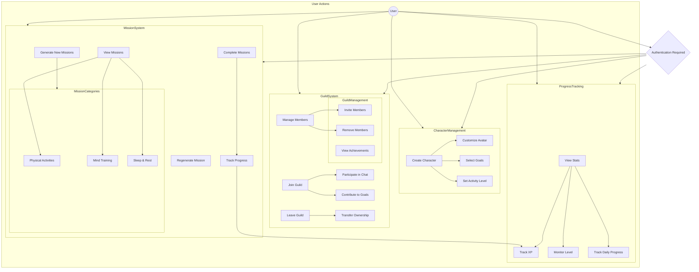

# HealthQuest Use Case Diagram

## Key Use Cases

### Character Management
1. Create new character
   - Choose avatar appearance
   - Set character name
   - Select fitness goals
   - Set activity level

### Mission System
1. View available missions by category
2. Complete missions using different tracking methods:
   - Timer-based tracking
   - Quick-add progress
   - Checkbox completion
3. Generate new missions based on:
   - User level
   - Activity preferences
   - Time of day
   - Previous completions
4. Regenerate unsuitable missions

### Guild System
1. Guild Membership
   - Search for guilds
   - Join guild
   - Leave guild
   - Transfer guild ownership
2. Member Management
   - Invite new members
   - Remove members (owner only)
   - View member status
3. Guild Activities
   - Participate in guild chat
   - Contribute to weekly goals
   - View guild achievements

### Progress Tracking
1. Track personal stats
   - XP gained
   - Current level
   - Active minutes
   - Steps taken
2. View achievements
3. Monitor daily progress
4. Track goal completion

## User Flows

### New User Flow
1. Create character
2. Set initial preferences
3. Access dashboard
4. Start first mission

### Daily User Flow
1. Check daily missions
2. View guild activities
3. Complete missions
4. Track progress
5. Interact with guild

### Guild Interaction Flow
1. Join guild
2. View guild missions
3. Participate in chat
4. Contribute to goals
5. View member activities

### Mission Completion Flow
1. Select mission
2. Track progress
3. Complete mission
4. Gain XP
5. Level up (if applicable)